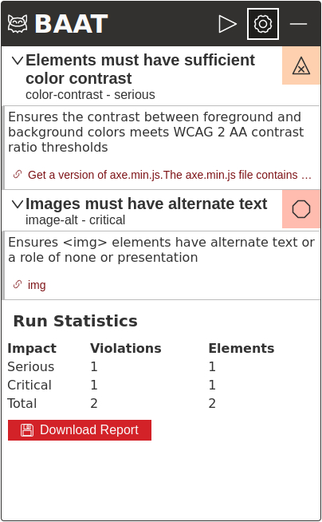

# BAAT 

BAAT is a small software tool that facilitates automated accessibility checks on websites. It utilizes axe-core to carry out the accessibility check quickly. With BAAT, users can obtain precise and automatic accessibility analysis results, making it a useful tool for any organization dedicated to accessible website development.

BAAT offers convenient alternatives to traditional accessibility checks. It can either be run as a bookmarklet or as a userscript, enabling its usage in cases where installations are not allowed on the machine.

## Features
- Provides automated accessibility checks for websites.
- Uses axe-core for quick and precise analysis.
- Can be run as a bookmarklet or userscript.
- Suitable for any organization dedicated to accessible website development.

## Installation

There are two ways to install and use BAAT:

### Installing BAAT as a bookmarklet
1. Head to the [releases page](https://github.com/mindscreen/baat/releases/latest).
2. Download the bookmarklet.txt file.
3. Create a new bookmark in your browser and paste the content of the bookmarklet.txt file into the URL field. _Note: the process of creating a bookmarklet can vary depending on your browser, so please refer to your browser's documentation for further information._

You're now ready to use BAAT as a bookmarklet.

Using BAAT as a bookmarklet allows you to perform automated accessibility checks on any website without having to install any software or scripts on your machine. Simply navigate to the website you want to test and activate the bookmarklet.

### Installing BAAT as a userscript
1. Install a userscript manager, such as [Tampermonkey](https://www.tampermonkey.net/).
2. Head to the [releases page](https://github.com/mindscreen/baat/releases/latest).
3. Download the userscript.js file.
4. Install the userscript.js file using your userscript manager.

You're now ready to use BAAT as a userscript.

Using BAAT as a userscript allows you to perform automated accessibility checks on any website without having to install any software on your machine. However, this method requires you to install a userscript manager first. Once installed, simply navigate to the website you want to test and activate the userscript.

## Prerequisites

In order to run BAAT you will need a minified built version of [Axe Core](https://github.com/dequelabs/axe-core)

## Usage
To use BAAT, follow these steps:

1. Go to the website you want to test.
2. Use the bookmarklet to activate the interface.
3. Click the "Select File" Button under Testscript. Now you will have to select the minified axe-core file.
4. If autorun is activated, the test will start automatically. Otherwise, click the "Run Test" Button.
5. Wait for a few seconds. The results will be shown in the "Results" section.

After axe-core has finished the test, you will be taken to the Results section. Here you can inspect the different issues. The findings are grouped by issue as elements which can be expanded by clicking on them.

Each issue contains the name of the issue, the type of issue, and the impact. In the top right corner of each issue, you can find an icon that displays the impact of the issue. If you expand the issue, you will see a longer description and a list of the elements that are affected by the issue.

By clicking on a link in the list, you can scroll to the element in the website.

### Options

#### Issue Impact Filters

The Issue Impact filters control which issues are shown in the results. The default is to show only serious or critical issues.

#### Developer mode

The developer mode is an advanced mode of BAAT. 
It will display the results of the axe-core test in a more detailed way. 
This is useful for developers who want to see the exact error messages.
It will also print some more debug info into the console.

## Links

- 🌎 [Project website](https://mscr.it/baat/)
- 🌎 [Axe Core](https://github.com/dequelabs/axe-core)

## Troubleshooting
### Content Security Policies (CSP)
Some websites use Content Security Policies (CSP) to restrict the execution of third-party scripts. If a website has a CSP that blocks the execution of third-party scripts, BAAT may not work as expected.

If you encounter issues with BAAT not running on a website, it's possible that the website has a CSP that blocks the execution of third-party scripts. In this case, you may need to contact the website administrator to request that they whitelist BAAT in their CSP.

## Building BAAT yourself
Bookmarklet for running axe-core tests directly in the Browser

1. Install dependencies with `npm install`
2. Build BAAT with `npm run build`

The primary color of the application is controlled by the following environment variables:

- `THEME_PRIMARY` (default: `#d32228`)
- `THEME_PRIMARY_LIGHT` (default: `#7e1317`)
- `THEME_PRIMARY_DARK` (default: `#ed4047`)